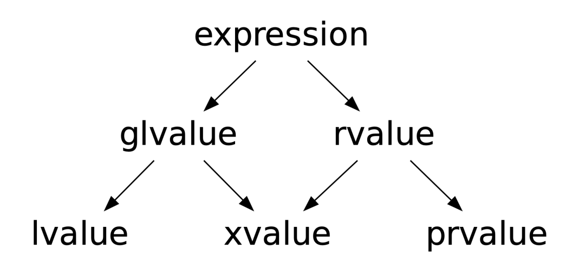
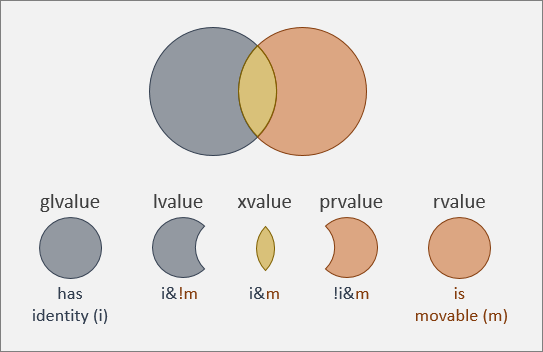

# (Since C++11) Expression categories, move semantics

## Problem

```C++
#include <vector>

std::vector<int> SomeFunction();

int main() {
  std::vector<int> a = SomeFunction(); // O(n) --- copy
  std::vector<int> b = std::vector<int>(100); // (until C++17) O(n) + O(n) --- construct + copy

  std::vector<int> c(100);
  std::vector<int> d = c; // How mark `c` as expired object?
}
```

# Expression categories

## [C++ standard](https://eel.is/c++draft/expr.prop)

### Expression
1. Category
2. Type 





