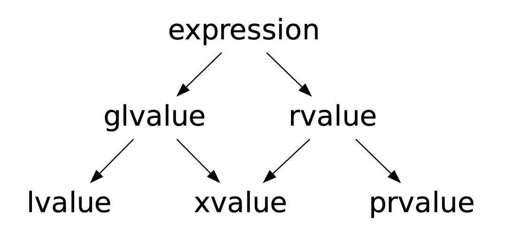
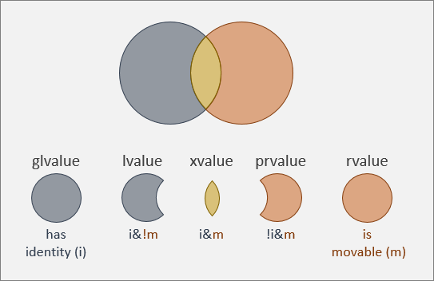

# (Since C++11) Expression categories, move semantics

## Problem

```C++
#include <vector>

std::vector<int> SomeFunction();

int main() {
  std::vector<int> a = SomeFunction(); // O(n) --- copy
  std::vector<int> b = std::vector<int>(100); // (until C++17) O(n) + O(n) --- construct + copy

  std::vector<int> c(100);
  std::vector<int> d = c; // How move `c` ?
}
```

## Todo
1. Function overloading from lvalue
2. Function overloading from rvalue
3. Move object

## Better todo
1. Function overloading from lvalue
2. Function overloading from rvalue
3. Move object -> mark as rvalue (expired)

# Expression categories

## [C++ standard](https://eel.is/c++draft/expr.prop)

### Expression
1. Category
2. Type





***
### __lvalue__
Имееют индентичность, не перемещаемы

__Не формально:__ можно взять адресс/материальны

---
### __rvalue__ (prvalue + xvalue)
Перемещаемы

__Не формально:__ всё что не lvalue
***

## Quiz №1

```C++
int x = 0;
int& rx = x;
const int& crx = x;
const int& tmp = 11;

int F();
int& G();
```


| Expression  |      Category       | Expression  |      Category       |
|:-----------:|:-------------------:|:-----------:|:-------------------:|
| `       x`  | >! &ensp; lvalue !< | `      rx`  | >! &ensp; lvalue !< |
| `     crx`  | >! &ensp; lvalue !< | `     tmp`  | >! &ensp; lvalue !< |
| `       5`  | >! prvalue       !< | `   2 + 2`  | >! prvalue       !< |
| ` x + crx`  | >! prvalue       !< | `      &x`  | >! prvalue       !< |
| `    &tmp`  | >! prvalue       !< | `   *(&x)`  | >! &ensp; lvalue !< |
| ` *(&crx)`  | >! &ensp; lvalue !< | ` x += 10`  | >! &ensp; lvalue !< |
| `     ++x`  | >! &ensp; lvalue !< | `     x++`  | >! prvalue       !< |
| `     F()`  | >! prvalue       !< | `F() + F()` | >! prvalue       !< |
| `     G()`  | >! &ensp; lvalue !< | `G() + G()` | >! prvalue       !< |
| `       G`  | >! &ensp; lvalue !< | `      &F`  | >! prvalue       !< |
| `"lvalue"`  | >! &ensp; lvalue !< |

***

### lvalue-reference   `T&`
### rvalue-reference   `T&&`
Как и `const T&` продлевают жизнь объекту, но позволяют его изменять.

***

## Example

```C++
int x = 0;
int& rx = x;

const int& crx = 5;
int&& rrx = 5;
const int&& crrx = 5; // useless

crx += 10; // CE
rrx += 10; // OK

int&& z = x; // CE
```

## Function overloading

### [std::addressof](https://en.cppreference.com/w/cpp/memory/addressof)

```C++
template <class T>
T* Addressof(T& object) {
  return &x;
  // return reinterpret_cast<T*>(
  //              &const_cast<char&>(
  //                  reinterpret_cast<const volatile char&>(arg)));
}

template <class T>
T* Addressof (T&&) = delete; // You are stupid

```

# Move constructor & move assignment | RO5

```C++
Vector(Vector&&);
Vector& operator=(Vector&&);
```


# Mark object as expired

## xvalue (eXpired-value/eXpert-only)
### Обладает индетичностью и перемещаем
### Нельзя получить адресс

## Example

```C++
int&& Foo();

Foo(); // xvalue
```

## std::move()

```C++
template <typename T>
decltype(auto) std::move(T&& value) {
  return static_cast<T&&>(value);
  // return static_cast<std::remove_reference_t<T>&&>(value);
}
```
### Example

```C++
int x = 4;
int&& y = x + 1;
std::cout << &x << ' ' << &y << '\n';

int&& z = std::move(x);
z = z + 1;
y = y + 1;
std::cout << x << ' ' << y << '\n';
```
```C++
struct S {
    int n = 0;
    int& access() { return n; }
};
S x;

int& y = x.access();  // OK
int& z = S{}.access();  // Error
int& v = std::move(x).access();  // OK
```

## Quiz №2

```C++
int x = 0;
int&& y = 5;
int&& rrx = std::move(x);

int&& Foo();
```

|   Expression   |       Category        |
|:--------------:|:---------------------:|
| `           x` | >!   &ensp; lvalue !< |
| `std::move(x)` | >!   &ensp; xvalue !< |
| `           y` | >!   &ensp; lvalue !< |
| `         rrx` | >!   &ensp; lvalue !< |
| `       Foo()` | >!   &ensp; xvalue !< |

